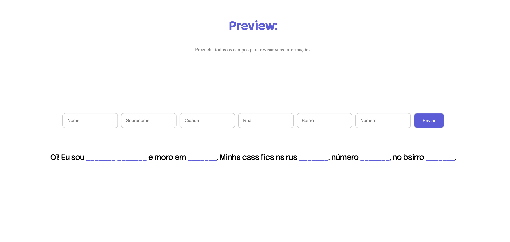
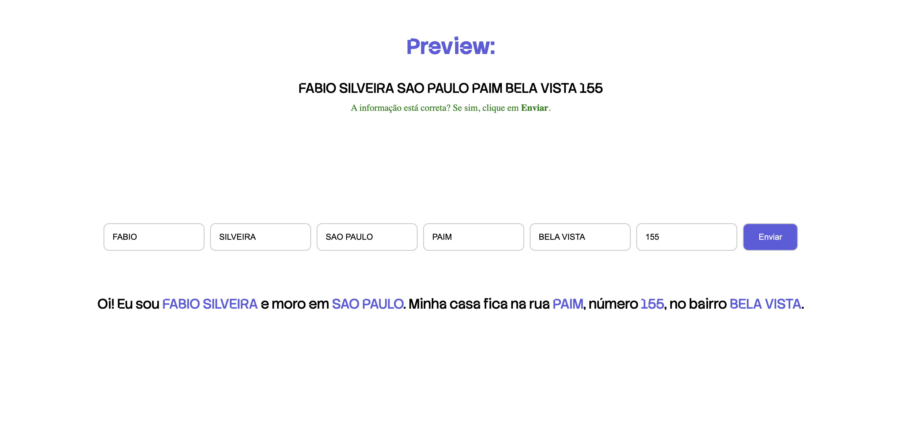

# Form Mock with `useState`

A small React + Vite project that demonstrates how to handle multiple form inputs using a **single object state** and dynamically update fields via a generic `handleChange`. It also logs all collected data when the user clicks **Enviar**.

---

## Features

- Manage multiple inputs with a single `useState` object (`nome`, `sobrenome`, `cidade`, `rua`, `bairro`, `numero`)
- Generic `handleChange` updates each field dynamically by name
- “Enviar” button triggers a function that prints the full form data to the console

---

## Tech Stack

- **React** with hooks (`useState`)
- **Vite** for build and development
- **JavaScript** + basic CSS styling

---

## Screenshot




## 🚀 Getting Started

Clone the repository and run locally:

```bash
# 1) Clone the repo
git clone https://github.com/fabioesilveira/Form-Mock-UseState.git

# 2) Navigate to project folder
cd Form-Mock-UseState

# 3) Install dependencies
npm install

# 4) Start the development server
npm run dev

